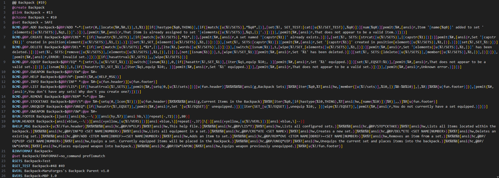
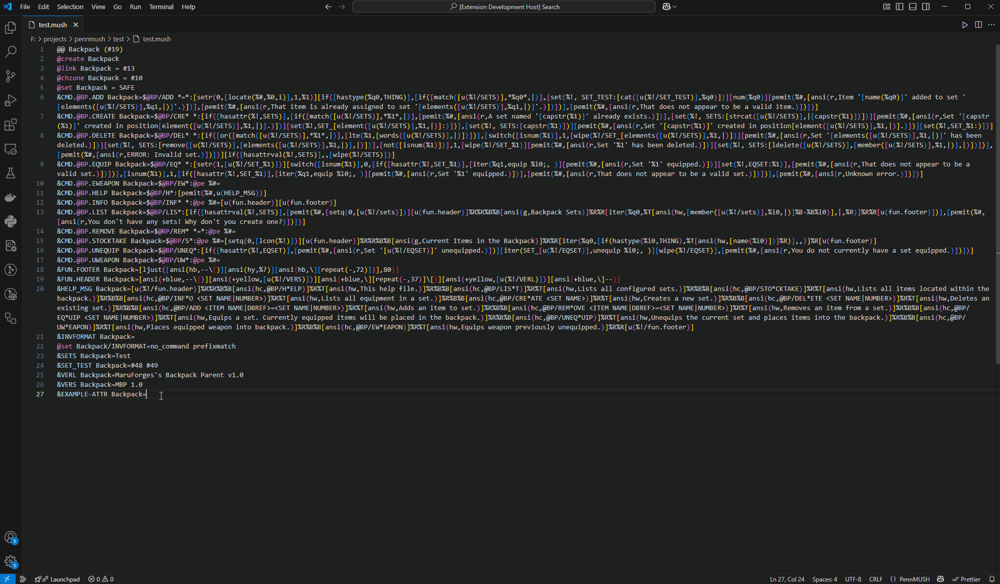
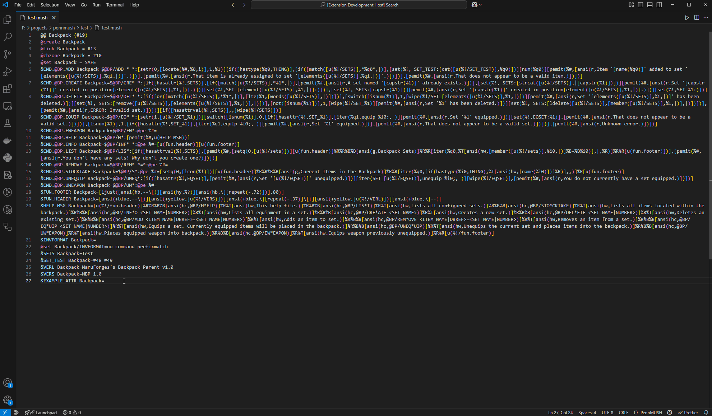
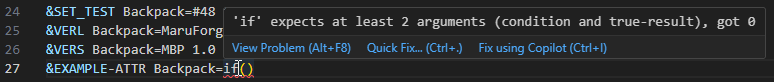
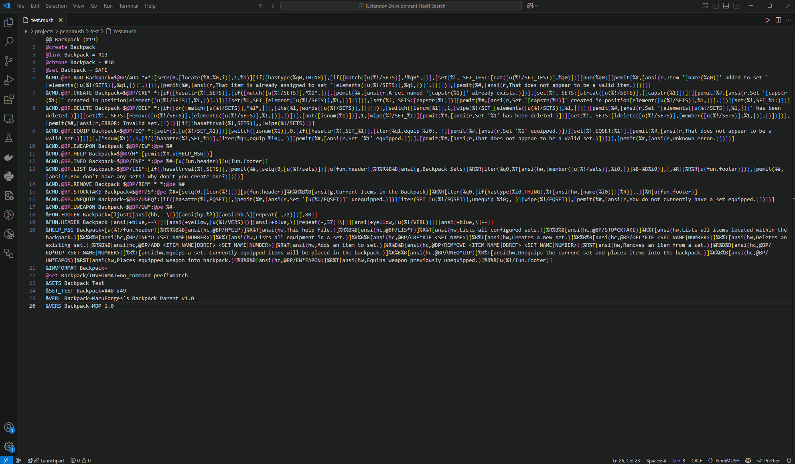

# PennMUSH Softcode Tools README

PennMUSH Softcode Tools is a Visual Studio Code extension that brings modern editing features to PennMUSH softcode. Whether you are maintaining a legacy database or building a brand-new MUSH from scratch, this extension turns VS Code into a fully-fledged PennMUSH IDE—complete with syntax highlighting, IntelliSense-style completions, inline diagnostics and a one-click code formatter.

---

## Features

| Screenshot | Description |
|------------|-------------|
|  | **Rich syntax highlighting** for commands, attributes, flags, built-in functions and inline colour codes. |
|  | **Context-aware completions** for the top 15 PennMUSH functions and common softcode commands, driven by snippets so you can tab through parameters. |
|  | **Signature Help** that shows parameter hints for **every builtin PennMUSH function** as you type, including optional arguments and default values. |
|  | **Live diagnostics** for unterminated brackets, unknown functions/attributes and arity (argument-count) errors, with quick-fixes where applicable. |
|  | **Prettify Softcode** command (⇧⌘P → *PennMUSH: Prettify Softcode*) that wraps long attribute values at `%R`, keeps `%B/%T` inline when sensible, and neatly indents nested functions. |

---

## Requirements

| Dependency | Minimum Version | Purpose |
|------------|-----------------|---------|
| Visual Studio Code | **v1.99** or higher | Brings tree-sitter engines required for incremental parsing. |
| Node.js | **v16 LTS** (only for local builds) | Needed if you _compile_ the extension from source. Users who install via the Marketplace do **not** require Node. |

No additional PennMUSH installation is needed—the extension is entirely self-contained.

---

## Extension Settings

| Setting | Description | Default |
|---------|-------------|---------|
| `pennmush.enableDiagnostics` | Toggle real-time linting. | `true` |
| `pennmush.prettify.lineLength` | Maximum line length before the formatter inserts a `%R`. | `80` |
| `pennmush.completions.topFunctionCount` | Number of high-frequency functions exposed in completions. | `15` |
| `pennmush.diagnostics.unknownAttributeSeverity` | Severity of “unknown attribute” warnings (`error`, `warning`, `info`, `hint`). | `warning` |

Settings are declared under `contributes.configuration` and are fully discoverable via VS Code’s GUI (*File → Preferences → Settings → Extensions → PennMUSH*).

---

## Known Issues

* Nested functions with deeply imbalanced brackets may still yield false positives in the arity checker.
* Files larger than ~5 MB may experience sluggish formatting on lower-spec machines.
* The formatter does **not** currently respect user-defined wrapper strings other than `%R`, `%B` and `%T`.

Please log bugs or suggestions on the [GitHub issues page](https://github.com/MaruForge/PennMUSHSoftcodeTools/issues) before raising duplicates.

---

## Contributing & Licence

Contributions are welcome—fork the repo, create a feature branch and open a pull request. The project is released under the **MIT Licence**; see `LICENCE` for details.

---

## Changelog

[Changelog](./CHANGELOG.md)

---

Happy softcoding, and may your `@dig`s never return “That exit already exists” again!